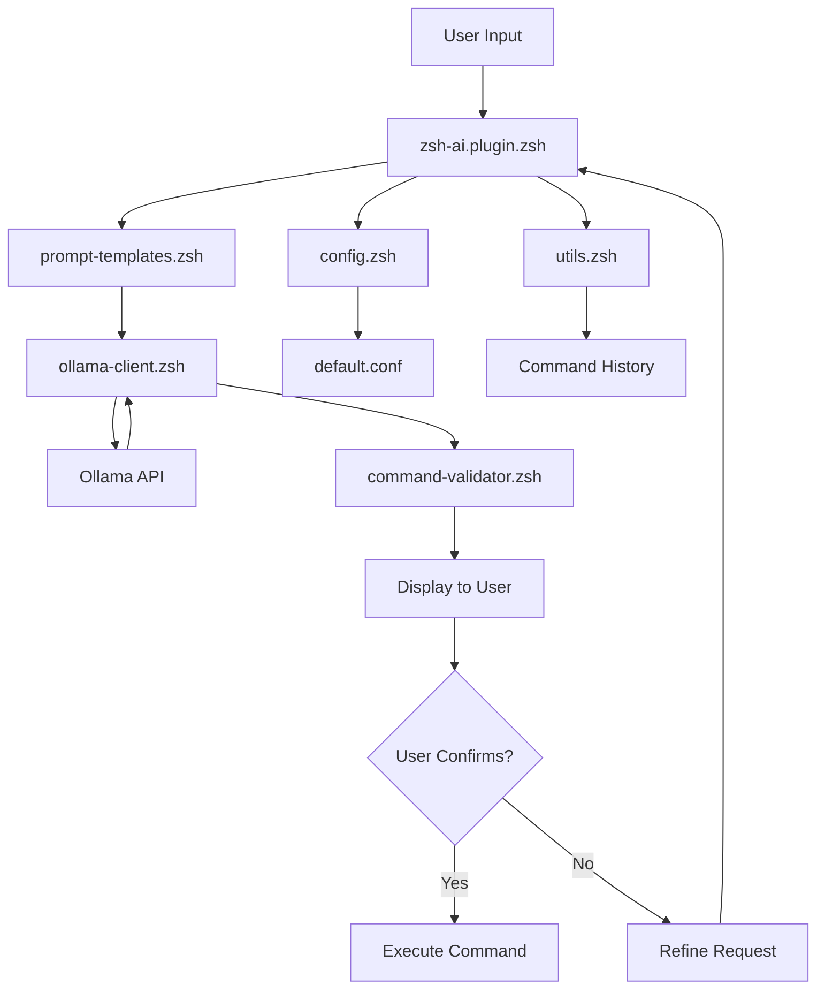

# ZSH-AI Plugin Project Plan

## Project Overview

The zsh-ai plugin will convert natural language to terminal commands using a local LLM via the Ollama API. It will include:
- Command generation from natural language input
- History integration to reference previously executed commands
- Command explanation features to help users understand what commands do
- Flexible model selection with configuration options

## Project Structure

```
zshAI/
├── zsh-ai.plugin.zsh         # Main plugin file
├── lib/                      # Library directory
│   ├── ollama-client.zsh     # API client for Ollama
│   ├── command-validator.zsh # Command safety validation
│   ├── config.zsh            # Configuration management
│   ├── utils.zsh             # Utility functions
│   └── prompt-templates.zsh  # LLM prompt engineering
├── config/                   # Config directory
│   └── default.conf          # Default configuration template
└── install.sh                # Installation script
```

## File Contents and Responsibilities

### 1. `zsh-ai.plugin.zsh`

This is the main entry point for the plugin. It will:
- Define user-facing commands and functions
- Source all necessary library files
- Set up command aliases and key bindings
- Initialize configuration

```zsh
#!/usr/bin/env zsh
#
# zsh-ai - Convert natural language to terminal commands using Ollama
#
# Author: [Your Name]
# License: MIT
# Version: 0.1.0
#

# Plugin directory
ZSHAI_DIR="${0:A:h}"

# Source library files
source "${ZSHAI_DIR}/lib/config.zsh"
source "${ZSHAI_DIR}/lib/utils.zsh"
source "${ZSHAI_DIR}/lib/ollama-client.zsh"
source "${ZSHAI_DIR}/lib/command-validator.zsh"
source "${ZSHAI_DIR}/lib/prompt-templates.zsh"

# Initialize configuration
zshai_init_config

# Define the main function
zshai() {
  # Parse arguments
  local query="$*"
  
  # Check if query is empty
  if [[ -z "$query" ]]; then
    zshai_print_usage
    return 1
  fi
  
  # Process the query
  zshai_process_query "$query"
}

# Define the command explanation function
zshai_explain() {
  local cmd="$*"
  
  # Check if command is empty
  if [[ -z "$cmd" ]]; then
    echo "Usage: zshai_explain <command>"
    return 1
  fi
  
  # Get explanation for the command
  zshai_get_explanation "$cmd"
}

# Define aliases
alias ai="zshai"
alias aiexplain="zshai_explain"

# Define key bindings (optional)
# bindkey '^X^A' zshai_widget

# Print plugin loaded message if verbose
if [[ "$ZSHAI_VERBOSE" == "true" ]]; then
  echo "zsh-ai plugin loaded"
fi
```

### 2. `lib/ollama-client.zsh`

This file will handle communication with the Ollama API. It will:
- Implement functions for sending prompts and receiving responses
- Manage model selection based on configuration
- Handle API errors and retries

```zsh
#!/usr/bin/env zsh
#
# ollama-client.zsh - API client for Ollama
#

# Send a prompt to Ollama and get the response
# Usage: zshai_ollama_generate "prompt" "model"
zshai_ollama_generate() {
  local prompt="$1"
  local model="${2:-$ZSHAI_DEFAULT_MODEL}"
  local api_url="${ZSHAI_OLLAMA_API_URL:-http://localhost:11434/api/generate}"
  local temp="${ZSHAI_TEMPERATURE:-0.7}"
  
  # Prepare the JSON payload
  local json_payload=$(cat <<EOF
{
  "model": "$model",
  "prompt": "$prompt",
  "temperature": $temp,
  "stream": false
}
EOF
)

  # Make the API request
  local response
  response=$(curl -s -X POST "$api_url" \
    -H "Content-Type: application/json" \
    -d "$json_payload")
  
  # Check for errors
  if [[ $? -ne 0 ]]; then
    echo "Error: Failed to connect to Ollama API"
    return 1
  fi
  
  # Extract the response text
  echo "$response" | grep -o '"response":"[^"]*"' | sed 's/"response":"//;s/"//'
}

# List available models from Ollama
zshai_list_models() {
  local api_url="${ZSHAI_OLLAMA_API_URL:-http://localhost:11434/api/tags}"
  
  # Make the API request
  local response
  response=$(curl -s "$api_url")
  
  # Check for errors
  if [[ $? -ne 0 ]]; then
    echo "Error: Failed to connect to Ollama API"
    return 1
  fi
  
  # Extract and display model names
  echo "$response" | grep -o '"name":"[^"]*"' | sed 's/"name":"//;s/"//'
}

# Check if Ollama is running
zshai_check_ollama() {
  local api_url="${ZSHAI_OLLAMA_API_URL:-http://localhost:11434/api/tags}"
  
  # Try to connect to the API
  curl -s -o /dev/null -w "%{http_code}" "$api_url" | grep -q "200"
  return $?
}
```

### 3. `lib/command-validator.zsh`

This file will validate generated commands for safety. It will:
- Implement checks for potentially dangerous operations
- Provide warnings or blocks execution of risky commands
- Allow configuration of safety levels

```zsh
#!/usr/bin/env zsh
#
# command-validator.zsh - Command safety validation
#

# Validate a command for safety
# Returns 0 if safe, 1 if potentially unsafe
zshai_validate_command() {
  local cmd="$1"
  local safety_level="${ZSHAI_SAFETY_LEVEL:-medium}"
  
  # Check for empty command
  if [[ -z "$cmd" ]]; then
    return 0
  fi
  
  # List of dangerous commands/patterns based on safety level
  local dangerous_patterns=()
  
  # Basic dangerous patterns (for all safety levels)
  dangerous_patterns+=(
    "rm -rf /*"
    "rm -rf /"
    "> /dev/sda"
    "mkfs"
    ":(){:|:&};:"  # Fork bomb
  )
  
  # Medium safety level adds more patterns
  if [[ "$safety_level" != "low" ]]; then
    dangerous_patterns+=(
      "rm -rf"
      "dd if=.* of=/dev/"
      "chmod -R 777"
      "chown -R"
      "> /etc/passwd"
    )
  fi
  
  # High safety level adds even more patterns
  if [[ "$safety_level" == "high" ]]; then
    dangerous_patterns+=(
      "sudo"
      "su -"
      "wget .* | bash"
      "curl .* | bash"
      "> /etc/"
      "mv .* /etc/"
    )
  fi
  
  # Check command against dangerous patterns
  for pattern in "${dangerous_patterns[@]}"; do
    if echo "$cmd" | grep -q "$pattern"; then
      return 1
    fi
  done
  
  # Command passed all checks
  return 0
}

# Get warning message for unsafe command
zshai_get_warning() {
  local cmd="$1"
  
  echo "⚠️  Warning: This command may be potentially dangerous:"
  echo "    $cmd"
  echo ""
  echo "Run 'zshai_explain \"$cmd\"' for an explanation before executing."
}

# Check and prompt for confirmation if command is unsafe
zshai_check_and_confirm() {
  local cmd="$1"
  
  # Validate the command
  if ! zshai_validate_command "$cmd"; then
    zshai_get_warning "$cmd"
    
    # If auto-confirm is disabled, prompt for confirmation
    if [[ "$ZSHAI_AUTO_CONFIRM" != "true" ]]; then
      echo -n "Do you want to execute this command anyway? [y/N] "
      read -r response
      
      if [[ ! "$response" =~ ^[Yy]$ ]]; then
        return 1
      fi
    fi
  fi
  
  return 0
}
```

### 4. `lib/config.zsh`

This file will manage plugin configuration. It will:
- Load default and user configurations
- Provide functions to get/set configuration values
- Handle configuration file paths and creation

```zsh
#!/usr/bin/env zsh
#
# config.zsh - Configuration management
#

# Default configuration values
ZSHAI_DEFAULT_MODEL="llama2"
ZSHAI_OLLAMA_API_URL="http://localhost:11434/api/generate"
ZSHAI_TEMPERATURE=0.7
ZSHAI_SAFETY_LEVEL="medium"
ZSHAI_AUTO_CONFIRM="false"
ZSHAI_VERBOSE="false"
ZSHAI_HISTORY_ENABLED="true"
ZSHAI_MAX_HISTORY=100
ZSHAI_CONFIG_DIR="${XDG_CONFIG_HOME:-$HOME/.config}/zsh-ai"
ZSHAI_HISTORY_FILE="${ZSHAI_CONFIG_DIR}/history.txt"
ZSHAI_USER_CONFIG="${ZSHAI_CONFIG_DIR}/config.conf"

# Initialize configuration
zshai_init_config() {
  # Create config directory if it doesn't exist
  if [[ ! -d "$ZSHAI_CONFIG_DIR" ]]; then
    mkdir -p "$ZSHAI_CONFIG_DIR"
  fi
  
  # Create history file if it doesn't exist and history is enabled
  if [[ "$ZSHAI_HISTORY_ENABLED" == "true" && ! -f "$ZSHAI_HISTORY_FILE" ]]; then
    touch "$ZSHAI_HISTORY_FILE"
  fi
  
  # Create user config file if it doesn't exist
  if [[ ! -f "$ZSHAI_USER_CONFIG" ]]; then
    zshai_create_default_config
  fi
  
  # Load user configuration
  zshai_load_config
}

# Create default configuration file
zshai_create_default_config() {
  local default_config="${ZSHAI_DIR}/config/default.conf"
  
  # If default config exists, copy it
  if [[ -f "$default_config" ]]; then
    cp "$default_config" "$ZSHAI_USER_CONFIG"
  else
    # Otherwise create a basic config
    cat > "$ZSHAI_USER_CONFIG" <<EOF
# zsh-ai configuration

# Ollama settings
ZSHAI_DEFAULT_MODEL="llama2"
ZSHAI_OLLAMA_API_URL="http://localhost:11434/api/generate"
ZSHAI_TEMPERATURE=0.7

# Safety settings
ZSHAI_SAFETY_LEVEL="medium"  # low, medium, high
ZSHAI_AUTO_CONFIRM="false"

# History settings
ZSHAI_HISTORY_ENABLED="true"
ZSHAI_MAX_HISTORY=100

# Misc settings
ZSHAI_VERBOSE="false"
EOF
  fi
}

# Load user configuration
zshai_load_config() {
  if [[ -f "$ZSHAI_USER_CONFIG" ]]; then
    source "$ZSHAI_USER_CONFIG"
  fi
}

# Get a configuration value
zshai_get_config() {
  local key="$1"
  local var_name="ZSHAI_${key}"
  
  # Return the value of the variable
  echo "${(P)var_name}"
}

# Set a configuration value
zshai_set_config() {
  local key="$1"
  local value="$2"
  local var_name="ZSHAI_${key}"
  
  # Set the variable
  eval "$var_name=\"$value\""
  
  # Update the config file
  if grep -q "^$var_name=" "$ZSHAI_USER_CONFIG"; then
    sed -i "s/^$var_name=.*/$var_name=\"$value\"/" "$ZSHAI_USER_CONFIG"
  else
    echo "$var_name=\"$value\"" >> "$ZSHAI_USER_CONFIG"
  fi
}

# Print current configuration
zshai_print_config() {
  echo "zsh-ai configuration:"
  echo ""
  echo "Ollama settings:"
  echo "  Default model: $ZSHAI_DEFAULT_MODEL"
  echo "  API URL: $ZSHAI_OLLAMA_API_URL"
  echo "  Temperature: $ZSHAI_TEMPERATURE"
  echo ""
  echo "Safety settings:"
  echo "  Safety level: $ZSHAI_SAFETY_LEVEL"
  echo "  Auto-confirm: $ZSHAI_AUTO_CONFIRM"
  echo ""
  echo "History settings:"
  echo "  History enabled: $ZSHAI_HISTORY_ENABLED"
  echo "  Max history: $ZSHAI_MAX_HISTORY"
  echo ""
  echo "Misc settings:"
  echo "  Verbose: $ZSHAI_VERBOSE"
}
```

### 5. `lib/utils.zsh`

This file will contain utility functions used across the plugin. It will:
- Implement history integration
- Provide terminal output formatting
- Handle error reporting and logging

```zsh
#!/usr/bin/env zsh
#
# utils.zsh - Utility functions
#

# Print usage information
zshai_print_usage() {
  cat <<EOF
Usage: zshai <natural language query>
       zshai_explain <command>

Examples:
  zshai "list all files sorted by size"
  zshai_explain "find . -type f -exec du -h {} \\; | sort -h"

Configuration:
  zshai_config          # Print current configuration
  zshai_set_config KEY VALUE  # Set configuration value
EOF
}

# Process a natural language query
zshai_process_query() {
  local query="$1"
  local model="$(zshai_get_config DEFAULT_MODEL)"
  
  # Check if Ollama is running
  if ! zshai_check_ollama; then
    echo "Error: Ollama is not running. Please start it with 'ollama serve'"
    return 1
  fi
  
  # Get command context from history if enabled
  local context=""
  if [[ "$(zshai_get_config HISTORY_ENABLED)" == "true" ]]; then
    context=$(zshai_get_history_context)
  fi
  
  # Generate the prompt
  local prompt=$(zshai_generate_command_prompt "$query" "$context")
  
  # Get command from Ollama
  echo "🤔 Thinking..."
  local command=$(zshai_ollama_generate "$prompt" "$model")
  
  # Check if command is empty
  if [[ -z "$command" ]]; then
    echo "Error: Failed to generate command"
    return 1
  fi
  
  # Validate the command
  if zshai_check_and_confirm "$command"; then
    # Add to history if enabled
    if [[ "$(zshai_get_config HISTORY_ENABLED)" == "true" ]]; then
      zshai_add_to_history "$query" "$command"
    fi
    
    # Print the command
    echo "💻 Generated command:"
    echo "$command"
    
    # Ask for confirmation before executing
    echo -n "Execute this command? [y/N] "
    read -r response
    
    if [[ "$response" =~ ^[Yy]$ ]]; then
      eval "$command"
    fi
  fi
}

# Get explanation for a command
zshai_get_explanation() {
  local command="$1"
  local model="$(zshai_get_config DEFAULT_MODEL)"
  
  # Check if Ollama is running
  if ! zshai_check_ollama; then
    echo "Error: Ollama is not running. Please start it with 'ollama serve'"
    return 1
  fi
  
  # Generate the prompt
  local prompt=$(zshai_generate_explanation_prompt "$command")
  
  # Get explanation from Ollama
  echo "🤔 Analyzing command..."
  local explanation=$(zshai_ollama_generate "$prompt" "$model")
  
  # Check if explanation is empty
  if [[ -z "$explanation" ]]; then
    echo "Error: Failed to generate explanation"
    return 1
  fi
  
  # Print the explanation
  echo "📖 Command Explanation:"
  echo "$explanation"
}

# Add a query and command to history
zshai_add_to_history() {
  local query="$1"
  local command="$2"
  local max_history="$(zshai_get_config MAX_HISTORY)"
  
  # Format: timestamp|query|command
  local entry="$(date +%s)|$query|$command"
  
  # Add to history file
  echo "$entry" >> "$ZSHAI_HISTORY_FILE"
  
  # Trim history if it exceeds max size
  if [[ $(wc -l < "$ZSHAI_HISTORY_FILE") -gt $max_history ]]; then
    tail -n $max_history "$ZSHAI_HISTORY_FILE" > "${ZSHAI_HISTORY_FILE}.tmp"
    mv "${ZSHAI_HISTORY_FILE}.tmp" "$ZSHAI_HISTORY_FILE"
  fi
}

# Get context from command history
zshai_get_history_context() {
  local max_entries=5
  
  # Get recent history entries
  if [[ -f "$ZSHAI_HISTORY_FILE" ]]; then
    tail -n $max_entries "$ZSHAI_HISTORY_FILE" | while IFS="|" read -r timestamp query command; do
      echo "Query: $query"
      echo "Command: $command"
      echo ""
    done
  fi
}

# Format output with colors
zshai_colorize() {
  local text="$1"
  local color="$2"
  
  case "$color" in
    red)    echo "\033[31m$text\033[0m" ;;
    green)  echo "\033[32m$text\033[0m" ;;
    yellow) echo "\033[33m$text\033[0m" ;;
    blue)   echo "\033[34m$text\033[0m" ;;
    *)      echo "$text" ;;
  esac
}
```

### 6. `lib/prompt-templates.zsh`

This file will define prompt templates for different LLM interactions. It will:
- Implement functions to format prompts with context
- Manage system prompts and user instructions
- Optimize prompts for command generation and explanation

```zsh
#!/usr/bin/env zsh
#
# prompt-templates.zsh - LLM prompt engineering
#

# Generate a prompt for command generation
zshai_generate_command_prompt() {
  local query="$1"
  local context="$2"
  
  # System prompt
  local system_prompt="You are a helpful assistant that converts natural language queries into terminal commands. Your task is to generate the most appropriate command for the user's query. Provide ONLY the command with no explanation or additional text."
  
  # User prompt with context if available
  local user_prompt=""
  if [[ -n "$context" ]]; then
    user_prompt="Here are some recent commands I've run:\n\n$context\n\nBased on this context, please convert the following query to a terminal command: $query"
  else
    user_prompt="Convert the following query to a terminal command: $query"
  fi
  
  # Combine prompts
  echo "$system_prompt\n\n$user_prompt"
}

# Generate a prompt for command explanation
zshai_generate_explanation_prompt() {
  local command="$1"
  
  # System prompt
  local system_prompt="You are a helpful assistant that explains terminal commands. Your task is to provide a clear, concise explanation of what the command does, breaking it down into its components. Include any potential risks or side effects."
  
  # User prompt
  local user_prompt="Explain the following terminal command in detail: $command"
  
  # Combine prompts
  echo "$system_prompt\n\n$user_prompt"
}

# Generate a prompt for command improvement
zshai_generate_improvement_prompt() {
  local command="$1"
  local feedback="$2"
  
  # System prompt
  local system_prompt="You are a helpful assistant that improves terminal commands based on user feedback. Your task is to modify the command to better match the user's intent. Provide ONLY the improved command with no explanation or additional text."
  
  # User prompt
  local user_prompt="Here is a command: $command\n\nBased on this feedback: \"$feedback\", please improve the command."
  
  # Combine prompts
  echo "$system_prompt\n\n$user_prompt"
}

# Generate a prompt for command alternatives
zshai_generate_alternatives_prompt() {
  local command="$1"
  
  # System prompt
  local system_prompt="You are a helpful assistant that provides alternative ways to accomplish the same task in the terminal. Your task is to suggest different commands that achieve the same result as the original command. Provide ONLY the alternative commands, one per line, with no explanation or additional text."
  
  # User prompt
  local user_prompt="Provide 2-3 alternative commands that accomplish the same task as: $command"
  
  # Combine prompts
  echo "$system_prompt\n\n$user_prompt"
}
```

### 7. `config/default.conf`

This file will contain default configuration settings. It will include:
- Model selection options
- Safety settings
- UI/UX preferences
- API endpoint configuration

```
# zsh-ai default configuration

# Ollama settings
ZSHAI_DEFAULT_MODEL="llama2"
ZSHAI_OLLAMA_API_URL="http://localhost:11434/api/generate"
ZSHAI_TEMPERATURE=0.7

# Safety settings
ZSHAI_SAFETY_LEVEL="medium"  # low, medium, high
ZSHAI_AUTO_CONFIRM="false"

# History settings
ZSHAI_HISTORY_ENABLED="true"
ZSHAI_MAX_HISTORY=100

# Misc settings
ZSHAI_VERBOSE="false"

# Available models (for reference)
# To use a different model, set ZSHAI_DEFAULT_MODEL to one of these values
# or any other model you have pulled in Ollama
#
# llama2
# llama2:13b
# llama2:70b
# codellama
# mistral
# mixtral
# phi
```

### 8. `install.sh`

This file will handle plugin installation. It will:
- Check for dependencies
- Set up configuration
- Provide instructions for manual setup if needed

```bash
#!/usr/bin/env bash
#
# install.sh - Installation script for zsh-ai plugin
#

# Colors
RED='\033[0;31m'
GREEN='\033[0;32m'
YELLOW='\033[0;33m'
NC='\033[0m' # No Color

# Plugin directory
PLUGIN_DIR="$(cd "$(dirname "${BASH_SOURCE[0]}")" && pwd)"

# Check for dependencies
check_dependencies() {
  echo "Checking dependencies..."
  
  # Check for zsh
  if ! command -v zsh &> /dev/null; then
    echo -e "${RED}Error: zsh is not installed${NC}"
    echo "Please install zsh and try again"
    exit 1
  fi
  
  # Check for curl
  if ! command -v curl &> /dev/null; then
    echo -e "${YELLOW}Warning: curl is not installed${NC}"
    echo "curl is required for API communication with Ollama"
    echo "Please install curl for full functionality"
  fi
  
  # Check for Ollama (optional)
  if ! command -v ollama &> /dev/null; then
    echo -e "${YELLOW}Warning: Ollama is not installed${NC}"
    echo "Ollama is required for local LLM functionality"
    echo "Please install Ollama from https://ollama.ai"
  fi
  
  echo -e "${GREEN}All critical dependencies are satisfied${NC}"
}

# Create configuration directory
setup_config() {
  echo "Setting up configuration..."
  
  # Create config directory
  CONFIG_DIR="${XDG_CONFIG_HOME:-$HOME/.config}/zsh-ai"
  mkdir -p "$CONFIG_DIR"
  
  # Copy default configuration if it doesn't exist
  if [[ ! -f "$CONFIG_DIR/config.conf" ]]; then
    cp "$PLUGIN_DIR/config/default.conf" "$CONFIG_DIR/config.conf"
    echo -e "${GREEN}Created default configuration at $CONFIG_DIR/config.conf${NC}"
  else
    echo -e "${YELLOW}Configuration already exists at $CONFIG_DIR/config.conf${NC}"
  fi
  
  # Create history file
  touch "$CONFIG_DIR/history.txt"
}

# Install plugin
install_plugin() {
  echo "Installing zsh-ai plugin..."
  
  # Check if .zshrc exists
  if [[ ! -f "$HOME/.zshrc" ]]; then
    echo -e "${YELLOW}Warning: $HOME/.zshrc does not exist${NC}"
    echo "Creating a new .zshrc file"
    touch "$HOME/.zshrc"
  fi
  
  # Check if plugin is already installed
  if grep -q "source.*zsh-ai.plugin.zsh" "$HOME/.zshrc"; then
    echo -e "${YELLOW}Plugin is already installed in .zshrc${NC}"
  else
    # Add plugin to .zshrc
    echo "" >> "$HOME/.zshrc"
    echo "# Load zsh-ai plugin" >> "$HOME/.zshrc"
    echo "source \"$PLUGIN_DIR/zsh-ai.plugin.zsh\"" >> "$HOME/.zshrc"
    echo -e "${GREEN}Plugin installed successfully${NC}"
  fi
}

# Print usage instructions
print_instructions() {
  echo ""
  echo -e "${GREEN}zsh-ai plugin installation completed${NC}"
  echo ""
  echo "To start using the plugin:"
  echo "1. Restart your terminal or run: source ~/.zshrc"
  echo "2. Make sure Ollama is running with: ollama serve"
  echo "3. Pull a model with: ollama pull llama2"
  echo ""
  echo "Basic usage:"
  echo "  zshai \"list all files sorted by size\"  # Generate a command"
  echo "  zshai_explain \"find . -type f | xargs du -h\"  # Explain a command"
  echo ""
  echo "For more information, run: zshai --help"
}

# Main installation process
main() {
  echo "=== zsh-ai Plugin Installer ==="
  echo ""
  
  check_dependencies
  setup_config
  install_plugin
  print_instructions
}

# Run the installer
main
```

## Implementation Plan

Now that we have defined the structure and content of each file, we can proceed with the implementation. Here's the plan:

1. Switch to Code mode to create the actual files
2. Create the directory structure
3. Create each file with the content outlined above
4. Test the plugin functionality

## Data Flow Diagram



## User Interaction Flow

```mermaid
sequenceDiagram
    participant User
    participant Plugin as zsh-ai Plugin
    participant Ollama as Ollama API
    
    User->>Plugin: Invokes command with natural language
    Plugin->>Plugin: Formats prompt with context
    Plugin->>Ollama: Sends prompt to API
    Ollama->>Plugin: Returns generated command
    Plugin->>Plugin: Validates command for safety
    Plugin->>User: Displays command with explanation
    User->>Plugin: Confirms or rejects command
    alt Command Confirmed
        Plugin->>User: Executes command
        Plugin->>Plugin: Adds to history
    else Command Rejected
        User->>Plugin: Provides refinement
        Plugin->>Ollama: Sends refined prompt
    end